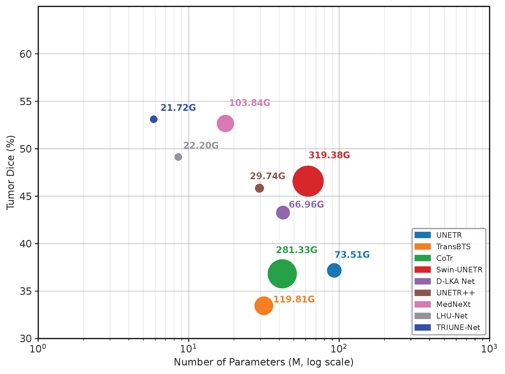
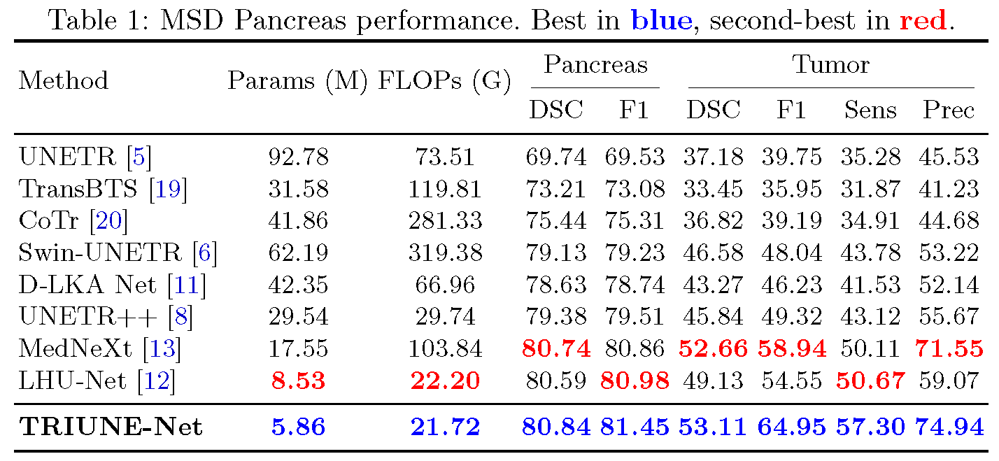
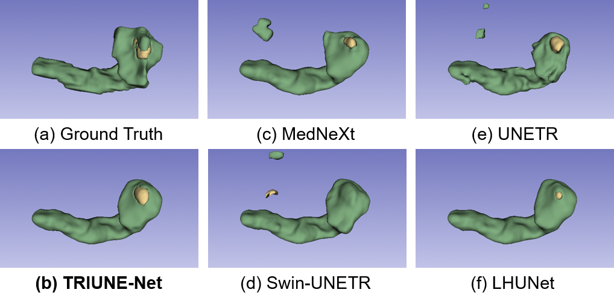
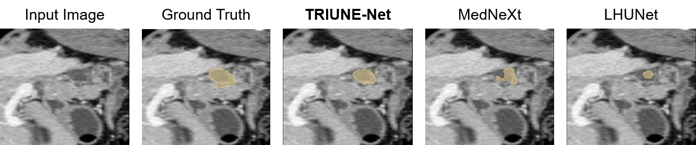

# TRIUNE-Net: Harmonizing Scale, Shape, and Efficiency in Pancreatic Tumor Segmentation

This repository contains the official implementation of **TRIUNE-Net**. Our paper, *"TRIUNE-Net: Harmonizing Scale, Shape, and Efficiency in Pancreatic Tumor Segmentation,"* addresses the growing complexity in medical image segmentation models, focusing on balancing computational efficiency with segmentation accuracy.

> Amir hossein saleknia, Alireza Kheyrkhah, Sanaz Karimijafarbigloo, Sina Houshmand, Reza Azad, Ulas Bagci, Dorit Merhof, Alaa Sulaiman 

## 📑 Table of Contents

1. [Abstract](#-abstract)
2. [Key Contributions](#zap-key-contributions)
3. [Model Architecture](#gear-model-architecture)
4. [Results](#-results)
5. [Getting Started](#-getting-started)
    - [Requirements](#%EF%B8%8F-requirements)
    - [Installation](#-installation)
    - [Training & Inference](#%EF%B8%8F-training--inference)
    - [Notes](#%EF%B8%8F-notes)
6. [Acknowledgments](#-acknowledgments)

## 📝 Abstract

Pancreatic tumor segmentation in 3D CT volumes is challenged by extreme scale 
variability across both the pancreas and tumor, and highly irregular tumor 
morphology. While recent advances have pushed segmentation performance, existing 
methods do not explicitly address these challenges and come at the cost of 
excessive computational complexity, limiting their practicality in 
resource-constrained clinical environments. We propose TRIUNE-Net, a lightweight 
unified architecture that harmonizes scale, 
shape, and efficiency through three synergistic innovations. A multi-scale 
context aggregation module with stage-adaptive dilated convolutions enables 
the model to reason across the broad range of anatomical scales present in 
both organs. A serial linear-deformable attention mechanism combines large 
effective receptive fields with shape-adaptive deformable convolutions to 
capture irregular, non-convex tumor morphologies. Finally, an information-preserving 
downsampling module replaces conventional max pooling entirely, retaining all 
spatial information while adding negligible parameters, preventing small tumors 
from being discarded before they can be recognized. On both the MSD Pancreas and NVD Pancreas datasets, TRIUNE-Net achieves state-of-the-art results with only 5.86\,M parameters and no external pre-training, outperforming all baselines across all key tumor metrics. Specifically, it surpasses the next-best model by 0.45\% in tumor Dice, 
6.0 points in F1 score, 6.6 points in sensitivity, and 3.4 points in precision,
simultaneously reflecting its ability to suppress both missed tumors and 
false alarms in clinically realistic conditions. Code will be made publicly available.

## :zap: Key Contributions

- **A lightweight and efficient architecture**: TRIUNE-Net has only 5.86 million parameters and 21.7 GFLOPs, processing a full CT volume in 1.7 seconds while outperforming much larger models.
- **Three complementary innovations in the Contextual Block**: The Multi-Scale Gated Aggregator (MSGA) handles extreme scale disparity, deformable large-kernel attention (D-LKA) adapts to irregular tumor shapes, and information-preserving downsampling (IPD) retains spatial details that max pooling would discard.
- **Superior performance on both real and synthetic datasets**: TRIUNE-Net achieves state-of-the-art tumor Dice (53.11% on MSD Pancreas) and improves sensitivity (+4.9% on small tumors) without sacrificing precision, making it practical for opportunistic screening in resource-constrained settings.

<p align="center">  </p>

## :gear: Model Architecture

TRIUNE-Net is a lightweight 3D segmentation network that uses a special Contextual Block to jointly handle extreme size differences, irregular tumor shapes, and loss of fine details, all while being faster and more accurate than larger models.

<p align="center">
  
</p>

*For a detailed explanation of each component, please refer to our paper.*

### Notes:
- The dataset splits used in our experiments can be found in the `splits_final.json` file within each pre-processed dataset folder.


## 📈 Results
TRIUNE-Net achieves superior tumor segmentation performance while maintaining the smallest model footprint. As shown in Figure 2, it reaches the highest tumor Dice score (53.11% on MSD Pancreas) with only 5.86 million parameters and 21.7 GFLOPs, outperforming heavier models like MedNeXt and Swin-UNETR across all key metrics.
<p align="center">
  
</p>

<p align="center">
  
</p>

<p align="center">
  
</p>

## 🚀 Getting Started

This section provides instructions on how to run **LHU-Net** for your segmentation tasks. It is built using **nnUNetV2** as its framework.

### 🛠️ Requirements

- **Operating System**: Ubuntu 22.04 or higher
- **CUDA**: Version 12.x
- **Package Manager**: Conda
- **Hardware**:
  - GPU with **8GB** memory or larger (recommended)
  - _For our experiments, we used a single GPU (A100-80G)_

### 📦 Installation

To install the required packages and set up the environment, simply run the following command:

```bash
./env_creation.sh
```

This will:

- Create a Conda environment named `lhunet`
- Install all the necessary dependencies
- Automatically move the essential files from the `src` folder to the `nnUNetV2` directory

### 🏋️ Training & Inference

For training and inference, you can use the provided shell scripts located in the `script` folder. These scripts are pre-configured for easy execution.

### ⚠️ Notes

- **Path Configuration**: Before running the scripts, make sure to update the paths in the shell script files to reflect your setup.
- **Metrics**: There is a `metrics` folder containing Python scripts that can be used to calculate **DSC (Dice Similarity Coefficient)** and **HD95 (Hausdorff Distance 95%)** metrics for each dataset.

## 🤝 Acknowledgments

This repository is built based on [nnFormer](https://github.com/282857341/nnFormer), [nnU-Net](https://github.com/MIC-DKFZ/nnUNet), [UNETR++](https://github.com/Amshaker/unetr_plus_plus), [MCF](https://github.com/WYC-321/MCF), [D3D](https://github.com/XinyiYing/D3Dnet/tree/master), [D-LKA](https://github.com/xmindflow/deformableLKA), [LHU-Net](https://github.com/xmindflow/LHUNet). We thank the authors for their code repositories.

  organization={Springer}
}
